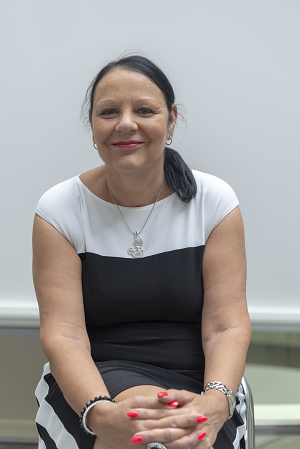

<link rel="stylesheet" href="S2.css">
<link rel="stylesheet" href="foghorn2.css">

## Arianne Schneider 

Bonjour à toutes et à tous !

Je me présente : je suis née à Rocourt le 20 juillet 1960, et j’habite en région liégeoise.

Ce qu'on dit de moi :  
&middot; toujours souriante, volontaire, sociable.

Les activités que j'aime :  
&middot; karaoké, jeux de société, cinéma et télévision.

## Mon parcours avant le SPF

Après des études professionnelles commerciales, j'ai obtenu le diplôme de connaissance de gestion.

Puis, j’ai travaillé pendant quatre ans en tant que contractuelle à l’hôpital de Bavière au service des prolongations des hospitalisations auprès des mutuelles.

  
*Les bâtiments de l'Hôpital de Bavière à Liège constituent un monument classé.*

Puis, après un temps de chômage, je me suis installée comme indépendante pendant un an.

## Et puis vint le Ministère (... et le SPF)

Je suis entrée comme contractuelle à l’INS pour réaliser une enquête budgétaire.

Pendant ce temps, j’ai passé l’examen de niveau D pour être dans une réserve.  
Tous comptes faits, je n'ai finalement pas eu à patienter trop longtemps : ma nomination a eu lieu en avril 1998. 

&Agrave; ce moment-là, j’ai commencé à travailler à la Direction générale de l'Information &Eacute;conomique (qui allait devenir S4 quelques années plus tard), et plus précisément au secrétariat de l’imprimerie.  
Là-bas, je me suis occupé des commandes, de calculer les prix de revient des brochures, et j'étais également chargée de la comptabilité des différents bureaux externes, de la vérification des factures et d’autres problèmes liés au contrat de SITA, etc.

Tout allait bien, jusqu'à une période de maladie assez longue.

Fort heureusement, j'ai pu revenir chez S4, mais cette fois à la presse, puis à la Bibliothèque, où j’ai appris à numériser les livres, à répondre aux demandes de la BCE/KBO.

## Pourquoi S2 ? Pourquoi le *Mailroom* ?

&Agrave; la Bibliothèque, j'ai également fait des recherches aux archives. 

La gestion de documents ne posant dès lors pas de problème pour moi, j'ai accepté bien volontiers de prendre du service à S2, cette fois au service du *Mailroom*.

Et, je pense : toujours aussi souriante et à votre service, histoire de justifier chaque jour ma réputation auprès de mes collègues et amis !

