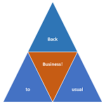

<link rel="stylesheet" href="foghorn2.css">
<link rel="stylesheet" href="Ulysses.css">
<link rel="stylesheet" href="S2.css">

# &nbsp;&nbsp;&nbsp;  Chess Lesson (2015)

Bienvenue dans une [leçon d'&Eacute;checs](https://sites.google.com/site/rdchessfra/lesson_04) créée en mai 2015 par Robert DUMOULIN.

Mais avant tout, un rappel des règles du jeu - [FR](https://fr.wikipedia.org/wiki/R%C3%A8gles_du_jeu_d%27%C3%A9checs) - [NL](https://nl.wikipedia.org/wiki/Schaken#Spelregels)

Et le petit dessin animé de Pixar ["**Geri's Game**"](https://www.youtube.com/watch?v=9IYRC7g2ICg)

## Pour commencer...

Cliquer sur les mots : [**Début de la leçon**](https://sites.google.com/site/rdchessfra/lesson_04/lesson_04_01)

Et laissez vous guider.

## ... ou pour une lecture systématique

1. [**Qui, du Fou ou du Cavalier, est le plus fort ?**](https://sites.google.com/site/rdchessfra/lesson_04/lesson_04_01)

    * La suprématie de la paire de Fous, selon [**HORRWITZ**](https://sites.google.com/site/rdchessfra/lesson_04/lesson_04_01/horrwitz)

2. [**Zones de force**](https://sites.google.com/site/rdchessfra/lesson_04/lesson_04_02)

    * ce qu'en dit [**Judit POLGAR**](https://sites.google.com/site/rdchessfra/lesson_04/lesson_04_02/page104) 

3. [**Début de la partie TARRASCH - TEICHMANN**](https://sites.google.com/site/rdchessfra/lesson_04/lesson_04_03)

4. [**Les stades ultérieurs de la pathologie**](https://sites.google.com/site/rdchessfra/lesson_04/lesson_04_04)

## D'autres leçons sur le même site

* [*Under Pressure*](https://sites.google.com/site/rdchessfra/lesson_01)
* [Genèse d'une nouveauté théorique](https://sites.google.com/site/rdchessfra/lesson_02)
* [Quand plane la menace de mat du couloir](https://sites.google.com/site/rdchessfra/lesson_03)
* [Question de tempérament](https://sites.google.com/site/rdchessfra/lesson_05)
* [Aperçu de la pratique des Échecs en 2015](https://sites.google.com/site/rdchessfra/home/analyses/Lesson_06)
* [Empoisonnement du Gambit du Roi](https://sites.google.com/site/rdchessfra/lesson_07/lesson_07_1)

