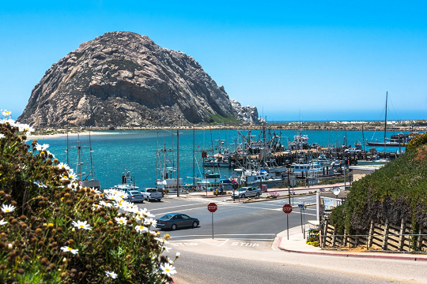

<link rel="stylesheet" href="S2.css">
<link rel="stylesheet" href="foghorn2.css">

## Julie Delvigne 

J’ai 19 ans, j’habite à Tournai et je suis la nouvelle collaboratrice administrative à l’accueil du City Atrium. 

## &Eacute;change américain

Vu mon âge, j'ai bien évident peu d'expériences professionnelles : jobs d'étudiante à la mutualité libérale de Tournai, au McDonald’s de Froyennes et chez O’Tacos à Tournai.

Diplômée l’année passée, je suis surtout partie pendant 6 mois faire un échange en **Californie**. 

  
*Morro Bay*

Cet échange m’a permis d’ouvrir les yeux sur la chance que j’avais de vivre en Belgique. J’ai aussi appris à profiter de l’instant présent et l’échange m’a aussi grandement ouvert l’esprit. 

C'est au point que, depuis mon retour, je ne cesse de regarder la Belgique sous un nouvel angle et d’être émerveillée par tout ce qu’elle a à offrir. 

## Mes centres d'intérêt

C'est très simple : pour moi, il y a l’écologie et le voyage. 

L’**écologie** est très importante pour moi et c’est la raison pour laquelle j’ai commencé à opérer des changements dans ma vie : je n’achète plus de vêtements faits par des grandes enseignes (à cause du côté écologique, mais aussi en raison du fait que les droits humains des travailleurs ne sont pas respectés), je consomme le moins possible dans des supermarchés, je fais mes courses bio et/ou zéro déchet, j’utilise mon vélo plutôt que la voiture, etc.  

L’écologie me passionne car c’est une réflexion constante sur ce que l’on fait et sur les solutions que l’on peut apporter à notre quotidien problématique.  
Je m’intéresse aussi beaucoup au plantes que j’adore cultiver afin de rendre mon intérieur plus sain.

En ce qui concerne mon goût pour les **voyages**, je ne cache pas que la Californie m'a donné le goût de découvrir toujours plus de nouvelles cultures.  

Ce qui m’intéresse dans les voyages, c’est vraiment le côté humain, le fait de s’ouvrir l’esprit en découvrant que notre façon de vivre n’est pas la seule qui fonctionne et que chaque système a ses bons comme ses mauvais côtés.  

Je n’aime pas, par exemple, partir dans une destination de "rêve" pour me prélasser au bord de la piscine, car c’est quelque chose que l’on peut, par exemple, faire dans un pays proche comme la France.  
Non : désormais, avant de partir à l'étranger, je me renseignerai d’abord sur la manière  dont les citoyens y sont traités (afin de ne pas donner mon argent à un gouvernement qui oppresse ses habitants) ; ensuite je chercherais à vivre le plus d’expériences enrichissantes possibles.  

J’aimerais donc faire plusieurs voyages humanitaires pendant ma vie, car je pense qu’il est important de réaliser combien, nous les Occidentaux, nous sommes privilégiés par rapport au reste du monde, et qu’il faut utiliser ce "privilège" pour faire le bien.

