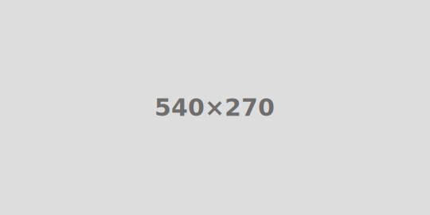
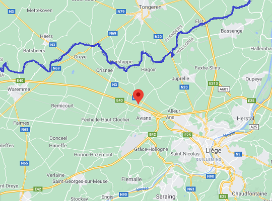

<link rel="stylesheet" href="S2.css">
<link rel="stylesheet" href="foghorn2.css">

## Sophie Peuskens 

Bonjour à tous,

Je m’appelle Sophie, j’ai 28 ans. J’habite dans un petit village de la Province de Liège, à Hognoul. 

> Hognoul était une commune à part entière, avant la fusion des communes. Depuis 1977, Hognoul fait partie d'Awans.

J’ai fait des études de droit à l’Helmo Saint-Martin à Liège et j’ai obtenu mon diplôme de bachelier en 2013. 

Ayant mon diplôme en poche, j’ai décidé de parfaire mes études et de suivre un master en gestion publique.

## Mes débuts

J’ai commencé ma carrière professionnelle au SPP Intégration sociale.  
J’y ai travaillé pendant 4 ans et demi. 

J'y traitais les dossiers de subvention au sein du service budget. 

## Et depuis septembre ...

J’ai ensuite postulé au SPF &Eacute;conomie et me voici donc parmi vous à S2 au sein du Service Financier depuis ce 1er septembre pour relever de nouveaux défis et acquérir de l’expérience dans de nouveaux domaines 😊 aux côtés de Denis [**Mailleux**](https://newdevprojects.github.io/publicinfo/S2/Denis_Mailleux.html).

## Mes loisirs

Durant mon temps-libre, j’aime faire du sport (fitness), des balades à pied, cuisiner des pâtisseries et voir mes amis.

