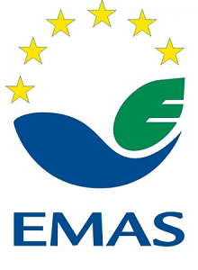

<link rel="stylesheet" href="S2.css">
<link rel="stylesheet" href="foghorn2.css">

## Vincent Zakowski 

Hallo, 

Ik ben Vincent Zakowski, geboren 7 mei 1984 in Antwerpen en woon nu in Schilde samen met mijn vrouw en twee dochters.

Ze omschrijven mij als spontaan, gedreven en realistisch. Ik houd van muziek op vinylplaten, de krant lezen, kamperen, ijsjes eten en spelen met mijn kindjes.

## FOD... Financiën en ik

Ik ben afgestudeerd in 2009 en heb een bachelor in het Sociaal Werk. Na enkele jaren in de privé ben ik als financieel deskundige begonnen in 2014 bij de Inning & Invordering van de FOD Financiën. 

Dit omvatte hoofdzakelijk het opvolgen van dossiers personenbelasting met openstaande schulden zowel frontoffice (loket) als backoffice (telefonisch, mail).  
Geval per geval bekeek ik wat de best geschikte methode zou zijn om een belastingplichtige zijn schuld aan te zuiveren. Dit kon vrijwillig zijn (afbetalingsplan, gebruiken teruggaves, …) of dwingend zijn (loonbeslag, beslag op financiële rekeningen, inbeslagnames door een deurwaarder, …).

## ... but already very close to *Facility*

Anderhalf jaar later heb ik de kans gegrepen om bij de Logistiek van FOD Financiën toe te treden.  
Hiervoor kon ik terugvallen op mijn **ervaringen in logistiek** van de jobs in mijn jaren voor ik startte bij de overheid. 

Zo ben ik eind 2015 gestart als Facilitair manager ('Celhoofd' heet dat daar) van het grootste regionale gebouw in Vlaanderen, de Amca in Antwerpen.  Daarbij was ik actief in alle facetten van facility management (hard & soft), gaande van het operationele niveau (day-to-day problemsolving, bestellingen & reserveringen, …), over het tactische niveau (aansturen van onderhoudsfirma’s, onthaalbalie, …), tot in het (micro-)strategische niveau (uitschrijven lokale visie, projecten individueel en/of ism de Regie Der Gebouwen, eigenaar van het gebouw, Stad Antwerpen en andere derde partijen. 

Daarnaast was ik actief betrokken in de **brandwerkgroep** van de FOD Financiën waarbij we een overkoepelend brandpreventiebeleid hebben uitgetekend voor het gehele FOD.  
Hiervoor hebben we risicoanalyses binnen alle gebouwen van de FOD uitgevoerd en hebben we een aanbesteding kunnen voltooien van software die de lokale operationele cellen in staat stelt om uniforme evacuatieplannen, interventiedossiers voor de hulpdiensten en een register van jaarlijkse controles & keuringen op te maken.

## En nu: de kans!

Stilaan voelde ik de nood om iets nieuws te doen en via [*Talent Exchange*](https://newdevprojects.github.io/publicinfo/S2/B2usualB/Talent_Exchange_NL.html) ben ik bij de FOD Economie binnengekomen. 

**Sinds 1 juni 2020** ben ik begonnen als EMAS-coördinator bij Facility.

