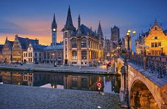
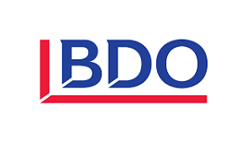

<link rel="stylesheet" href="S2.css">
<link rel="stylesheet" href="foghorn2.css">

## Je m’appelle Denis…

Je suis Nivellois d’origine mais j’ai passé la frontière linguistique en 2012 pour m’installer dans la belle ville de Gand. Après avoir travaillé comme éducateur, j’ai fait une formation d’aide comptable au Forem. Ensuite, j’ai terminé en 2012 un bachelier en comptabilité en cours du soir et en 2015 un master en management au FUCAM également en cours du soir. Je suis actuellement en 3ème année de stage à l’Institut des Experts-Comptables mais je compte mettre ce stage entre parenthèse pour me consacrer pleinement au SPF Economie.

J’ai travaillé pendant plus de 10 ans dans un bureau comptable. Le bureau comptable de 20 personnes où j’ai commencé en 2008  avait été racheté en 2013 pour faire partie de BDO - une entreprise de près de 600 personnes. Aujourd’hui, le SPF Economie me permet de faire connaissance avec le secteur public ainsi qu’avec une structure encore plus grande que ce que j’ai pu connaître jusqu’ici.

Tout comme [Robert Dumoulin](https://newdevprojects.github.io/S2/RD_F.html), j’ai un lien particulier avec la France vu que ma compagne est française. Mes enfants (&Eacute;line (2 ans et 10 mois) et Edgar (3 mois)) ont donc la double nationalité Belge et Française, ce qui ne les empêche pas de raccourcir mes nuits pour l’instant…

