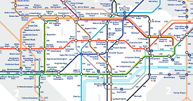
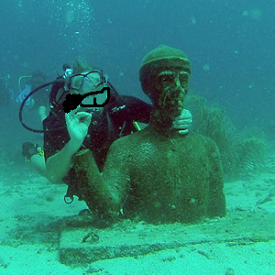

<link rel="stylesheet" href="S2.css">
<link rel="stylesheet" href="foghorn2.css">

## Dita, c'est moi ! 

Je m’appelle Dita Uslu et je vis dans un quartier animé d’Ixelles.

Après mes études de droit à l’Institut Supérieur Economique d’Ixelles, je suis partie **à Londres** avec l’objectif d’améliorer mon anglais et avec **un plan très simple : me débrouiller**, une fois sur place, pour trouver du travail et rester aussi longtemps que nécessaire.  
J'y suis finalement restée six mois, et ce fut une merveilleuse aventure non seulement professionnelle, mais également humaine, qui m’a appris énormément en peu de temps.

 "*Survivre à Londres...*"

&nbsp;

A mon retour, j’ai travaillé pendant plus de trois années au Palais de Justice de Bruxelles.  
J’étais greffière au Tribunal Correctionnel - section m&oelig;urs - pendant plus de 2 ans et ensuite au Tribunal de la Jeunesse.  
Cette expérience extrêmement intéressante et marquante m’a rapidement permis de **plonger dans notre système judiciaire** en confrontant la théorie à la pratique et de confirmer l’adage selon lequel la réalité dépasse bien la fiction.

 "*En plongée pendant 3 ans...*"

&nbsp; 

J’ai ensuite eu l’opportunité de rejoindre la Politique Scientifique Fédérale (Belspo) avec comme *challenge* de travailler dans un nouveau domaine et dans un contexte international. Je suis restée à [Belspo](https://www.belspo.be/) près de 10 ans en tant que responsable légale et financière des projets européens de recherche.  

J’y étais notamment en charge de la gestion administrative et financière des projets européens, des rapportages liés à ces projets et des contacts avec la Commission Européenne.

## Et maintenant ?

J’ai intégré le Service Achat le 17 juin 2019 et, du coup, une nouvelle page professionnelle est en train de s’écrire.

Je suis, entre autres, passionnée par les livres, les voyages et les rencontres d’autres cultures et la musique. D'ailleurs, j’essaie désespérément que ma guitare sonne ... **;-)** juste.   
J'aime aussi beaucoup la photographie, ainsi que les balades dans la nature.

