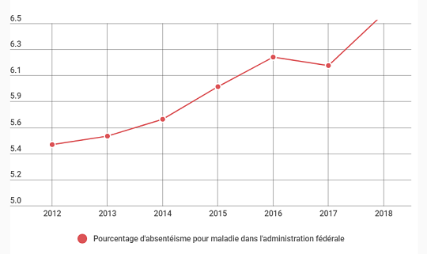
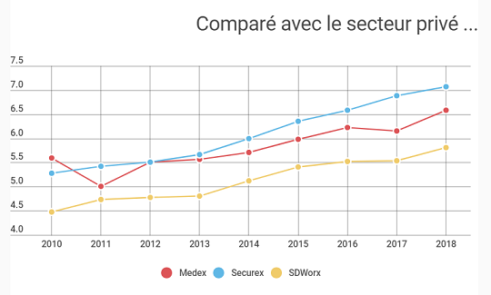
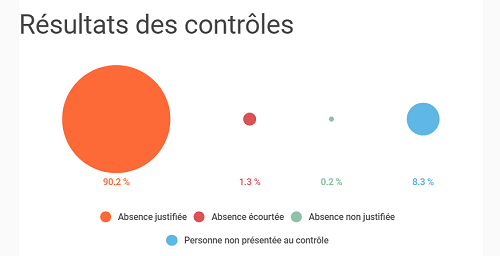
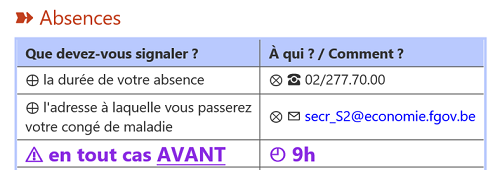

<link rel="stylesheet" href="S2.css">
<link rel="stylesheet" href="foghorn2.css">

Op 24 oktober 2020 werd een infosessie geörganiseerd door Mathias Lenaerts over het personeelsbeleid van de Facilitaire Dienst.

Het ging meer bepaald over het prikken, werkregimes en recuperatie van overuren (05, 06A en 06B), organisatie van telewerk en ziektemelding.

Onze *Quick Info S2* is een gelegenheid om te herinneren aan wat er bij deze gelegenheid werd gezegd, want het is *mutatis mutandis* van toepassing voor de meeste S2-medewerkers.

## Verlof & recuperatie van overuren

| Codes *Prime Time* | *Deadlines* |
| --- | --- | --- |
| 01A - jaarlijks verlof 2020 | 31.12.2021 |
| 01B - jaarlijks verlof 2019 | 31.12.2020 |
| 01C - gespaard verlof | &otimes; (= onbeperkt, *ad lib.*) |
| 05&nbsp;&nbsp; - overuren (variabele uurregeling) | 1 &half; d. &rarr; einde van volgende maand |
| 06A - overuren (vaste uurregeling) | binnen 4 maanden (... maar AR 2000!) |

&nbsp;

[Rapport sur l'application en 2019 des 06A]()

[Quels types de congé sont-ils possibles ?]()

Une question ? / Un doute ?  
&#10173; &#9743; ou &#9993; &rarr; Correspondant RH 

## Signalement des absences pour maladie

Absentéisme de 2010 à 2018 (Source: Medex)

| Chiffres bruts | Comparaison |
| --- | --- |
|  |  |
| <mark>scandale !!!</mark> de 5,4% à 6,6% (2012-2018) | public : 5,6%&rarr;6,6% = &Delta; +18% SDWorx : 4,5%&rarr;5,9% = &Delta; +31% Securex : 5,3%&rarr;7,1% = &Delta; +34% |

&nbsp;

&nbsp;

