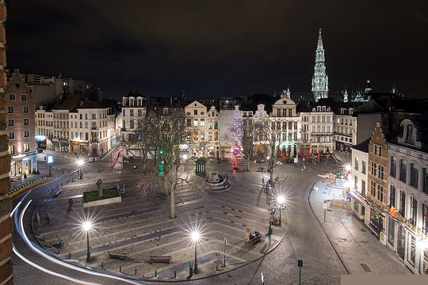

<link rel="stylesheet" href="S2.css">
<link rel="stylesheet" href="foghorn2.css">

## Maria Eugenia Bardaro 

Ik ben opgegroeid op een klein eiland in het zuiden van Italië, Procida. Ik bracht mijn jeugd daar door met kijken naar de zee en vroeg me af over de schoonheid en de complexiteit van de wereld.

## Mijn zijderoute

Ik heb Politicologie en Internationale Betrekkingen gestudeerd aan de Universiteit van Napels met een specialisatie in Noordoost-Azië.

Na mijn afstuderen ben ik naar Azië gevlogen.  
Na een paar jaar tussen China en Japan te hebben doorgebracht, keerde ik terug naar Europa.

## "Bruxelles, ma Belle" (Dick Annegarn)

Een korte stop van een jaar aan de ULB, de tijd om een ​​DEA in Politicologie te behalen, en ik vestigde me in Brussel, ... die ik sindsdien niet meer heb verlaten.

In België komen wonen was het resultaat van een zuiver toeval.

Ik werd echter verliefd op Brussel en vervolgens op de rest van dit land, dat voldoende surrealistisch was om zowel fascinerend als vertederend te zijn.

## Mijn loopbaan

Ik begon al snel te werken bij de permanente vertegenwoordiging van Italië bij de Europese Unie en vervolgens bij de ULB waar ik assistent was.  
Dankzij de specifieke kenmerken van de academische omgeving kon ik me onderdompelen in het hart van veel hedendaagse politieke debatten.

Ik verliet de academische wereld omdat ik dichter bij het veld nieuwe, meer concrete uitdagingen nodig had.

Ik werkte 6 jaar als politiek medewerker bij cdH. Ik had de leiding over Europese kwesties, migratie, defensie en internationale betrekkingen. Hierdoor kon ik de complexiteit van het Belgische politieke en institutionele systeem begrijpen. Ik heb al die jaren Belgisch en Europees nieuws gevolgd, toespraken en talloze politieke notities geschreven en honderden parlementaire vragen beantwoord.

Maar toen was het tijd voor een nieuwe uitdaging!

## Wat nu?

Sinds begin februari werk ik als projectmanager bij de Facilitaire Dienst.

Dit is dus een nieuwe kans en vooral het begin van een nieuw hoofdstuk in mijn professionele leven.