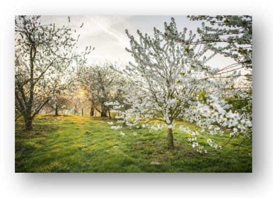

<link rel="stylesheet" href="S2.css">

## Wie ben je? 

Mijn naam is Natascha Verbruggen

## Regio? 
Woonachtig te Montenaken, is een dorpje in de Belgische provincie Limburg en een deelgemeente gemeente Gingelom, in de regio Haspengouw. Vooral bekend voor hun bloesemroute

## Loopbaan?

In juli werk ik 20 jaar bij de FOD Economie, Sinds 1 april ben ik gestart bij de aankoopdienst.

Even kort wat over mijn loopbaan tot dusver. Na mijn studie ben ik werkzaam geweest als administratief assistent bij E2. In 2011 heb ik de overstap gemaakt naar de HR-wereld (Cel: Opleidingen & Ontwikkeling), omdat ik zocht naar een baan waarbij ik meer persoonlijk contact met medewerkers had. Ik ben toen begonnen bij S1 als opleider /administratief assistent, dit heb ik vervolgens 8 jaar lang gedaan, tot deze nieuwe uitdaging op mijn pad kwam.

## Hobby’s?

Een van mijn lievelingshobby is reizen, de vakantiebestemming dat nog op mijn verlanglijstje staat is Zuid-Afrika. Verder ben ik in mijn privéleven bezig met een groot project, de verbouwing van mijn huis wat een groot deel van mijn tijd in beslag neemt. Maar waar ik mij ook kan uitleven in het decoreren en inrichten ervan. Om toch eens af en toe te ontspannen ga ik regelmatig wandelen. Als er dan nog vrije tijd over blijft ben ik te vinden in de dansschool of rondom de barbecue met mijn vrienden. 

