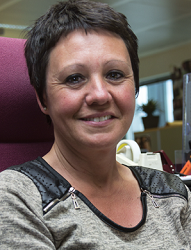

<link rel="stylesheet" href="S2.css">
<link rel="stylesheet" href="foghorn2.css">

## Wie ben je? 

Sandrine a intégré le personnel d'accueil du North Gate. Elle se présente sous la forme d'un petit [portrait chinois](https://fr.wikipedia.org/wiki/Portrait_chinois).

## Mon portrait...

Et si j'étais une saison... 
* l’été

Et si j'étais un animal...
* la panthere noire

Et si j'étais une couleur...
* le noir

Et si j'étais un film...
* Pretty Woman

Et si j'étais un verbe...
* dynamiser

Et si j'étais un instrument de musique...
* la guitare électrique

Et si j'étais un (des) loisir(s)...
* les voyages, la cuisine, ...

## Mon parcours 

Je suis originaire d'Ath.  
J'ai commencé ma carriére comme infirmiere dans le privé dans un service de gériatrie.  
Je suis arrivée au SPF &Eacute;conomie ensuite comme secrétaire médicale du dentiste du département.  
Ensuite, j’ai intégré l’équipe des infirmieres du SPF. Je m’occupais des soins, des vaccinations et des prises de sang.  
&Agrave; la pension du Dr. Stulens, j'ai intégré le Contact Center. Dans le groupe 3 "*Enquêtes*", je répondais aux questions de propriété intellectuelle, de sécurité des produits et de statistiques.  

Et me voici à S2 depuis juin 2019 !