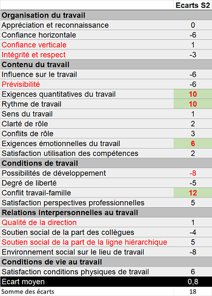
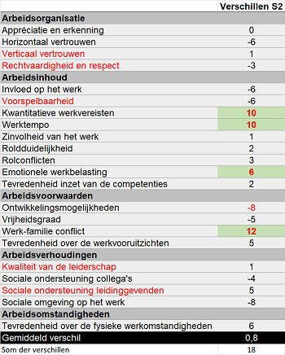
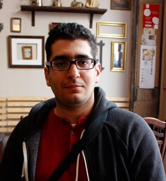

<link rel="stylesheet" href="S2.css">

# Liens S2 hiver 2021 S2 Links winter 2021

| Sommaire / Inhoud |
| :---: |
|  [**&#9312;**](https://newdevprojects.github.io/publicinfo/S2/winter_2021.html#comment-vous-remercier-tous-hoe-kunnen-we-jullie-allemaal-bedanken)  &nbsp; Comment vous remercier tous ? Hoe kunnen we jullie allemaal bedanken? &nbsp; |
|  [**&#9313;**](https://newdevprojects.github.io/publicinfo/S2/winter_2021.html#vivre--s2-r%C3%A9sultats-analyse-psychosociale-2021leven--s2-resultaten-psychosociale-analyse-2021)  &nbsp; Vivre @ S2 (résultats analyse psychosociale 2021) Leven @ S2 (resultaten psychosociale analyse 2021) &nbsp; |
|  [**&#9314;**](https://newdevprojects.github.io/publicinfo/S2/winter_2021.html#ins--outs-2021)  &nbsp; IN's & OUT's 2021 &nbsp; |

## &#9312; Comment vous remercier tous ? Hoe kunnen we jullie allemaal bedanken?

Il était de coutume que, chaque année, les services de S2 organisent, soit une réception de Nouvel An, soit un team building. Naar jaarlijkse gewoonte organiseren de diensten van S2 ofwel een nieuwjaarsreceptie, ofwel een teambuilding.

Tout comme en 2020, c’eût encore été autant d’événements attendus avec impatience par nos collaborateurs. Mais, malheureusement, en raison de la situation actuelle qui prévaut depuis un certain temps, ils n’ont pas pu avoir lieu. Pour remplacer ce team building et/ou la réception du Nouvel An 2022, nous souhaitons offrir à tous les collaborateurs de S2 un cadeau de Noël et de Nouvel An. Hier werd net zoals in 2020 reikhalzend naar uit gekeken door onze medewerkers maar helaas door de huidige situatie die al een tijd heerst is dit niet kunnen doorgaan. Ter vervanging van deze teamuitstap en/of nieuwjaarsreceptie van 2022, wensen we alle S2-medewerkers een Kerst- en nieuwjaarsgeschenk aan te bieden.

Comme les effets de la pandémie mondiale se traduisent également chez nos commerçants belges, nous avons opté pour une formule de panier-cadeau Leonidas. <strong>Ce panier-cadeau vous sera livré à domicile.</strong>
  

Het gevolg van de wereldwijde pandemie vertaalt zich ook naar onze Belgische handelaars, vandaar ook dat we graag opteren voor een geschenkmand van Leonidas. <strong>Deze geschenkmand zal aan huis worden geleverd.</strong>

## &#9313; Vivre @ S2 (résultats analyse psychosociale 2021) Leven @ S2 (resultaten psychosociale analyse 2021)

* **Résultats pour tout le SPF** - [intranet](Intranet_risques_2021_SPF.html)
* **Participation S2 : 45 %** (51 % pour le SPF)

* **&Eacute;carts entre S2 et le SPF**

| S2 fait mieux que le SPF (moy.) | S2 fait moins bien que le SPF (moy.) |
| --- | --- |
| Conflit travail-famille **+12** | Environnement social sur lieu de travail **- 8** |
| Exigences quantitatives du travail **+10** | Possibilités de développement **- 8** |
| Rythme de travail **+10** | &nbsp; |

* **Comparaison S1/SPF et S2/SPF** - [fichier Excel](Ecarts_S1-SPF-Vs-Ecarts_S2-SPF.xlsx)

---

* **Resultaten voor de hele FOD** - [intranet](Intranet_risicos_2021_FOD.html)
* **Deelname S2: 45%** (51% voor de hele FOD)
* **Verschillen tussen S2 en de FOD**

| S2 doet beter dan de FOD gem. | S2 doet minder dan de FOD gem. |
| --- | --- |
| Werk-familie conflict **+12** | Sociale omgeving op het werk **- 8** |
| Kwantitatieve werkvereisten **+10** | Ontwikkelingsmogelijkheden **- 8** |
| Werktempo **+10** | &nbsp; |

* **Vergelijking S1/FOD en S2/FOD** - [Excel bestand](Verschillen_S1-SPF-Vs-Verschillen_S2-SPF.xlsx)

## &#9314; IN's & OUT's 2021

| IN | OUT |
| ---: | ---: |
| 05.01.2021 - Maarten <b>LEBACQ</b> (Onthaal NG)  | 01.02.2021 - Pieter <b>DHAESE</b> (interne mobiliteit E6)  |
| 01.02.2021 - Hugues <b>CLOES</b> (mobilité interne S4)  | 01.03.2021 - Vincent <b>ZAKOWSKI</b> (Talent Exchange)  |
| 01.03.2021 - Saïd <b>BELLAJI</b> (retour de Talent Exchange) | 01.05.2021 - Maria <b>VAN ESSCHE</b> (pensioen) |
| 01.04.2021 - Najet <b>A&Iuml;T-TAMSADEN</b> (mobilité interne S4)  | 01.05.2021 - Martine <b>VAN HERZELE</b> (pensioen)  |
| 15.04.2021 - Dirk <b>MACHIELS</b> (Einde loopbaanonderbreking) | 01.07.2021 - Christina <b>JANSSENS</b> (pensioen) |
| 03.05.2021 - Nils <b>VLASSENBROECK</b> (assistent Gebouwcontact)  | 01.09.2021 - Lucienne <b>BERVAES</b> (pensioen)  |
| 01.08.2021 - Laurent <b>CRABECK</b> (Secrétariat Facility)  | 01.09.2021 - Annick <b>NEUCKERMANS</b> (pensioen)  |
| 15.08.2021 - Myra <b>BOULY</b> (Mailroom F)  | 01.10.2021 - Gerard <b>RAMAEKERS</b> (pensioen)  |
| 01.09.2021 - Julie <b>DEPOORT&Egrave;RE</b> (Mailroom F)  | 01.01.2022 - Lydia <b>DIDIOT</b> (pension)  |
| 01.09.2021 - Frédérique <b>GODART</b> (Archives)  | &nbsp; |
| 01.09.2021 - Taha <b>MARSOU</b> (Secrétariat Directeur)  | &nbsp; |
| 06.09.2021 - Yousra <b>BOUJNANI</b> (Comptabilité Belexpo)  | &nbsp; |
| 01.10.2021 - Katy <b>LASSUY</b> (Budget en Subsidies)  | &nbsp; |
| 01.10.2021 - Alex <b>REMBAUT</b> (Mailroom N)  | &nbsp; |
| 18.10.2021 - Reninca <b>GITS</b> (interne mobiliteit S1)  | &nbsp; |
| 03.11.2021 - Kenny <b>BAUWENS</b> (Archieven)  | &nbsp; |
| 03.11.2021 - Kristof <b>BOSMANS</b> (Mailroom N)  | &nbsp; |
| 15.12.2021 - Jonas <b>NEYT</b> (Gebouwcontact)  | 01.02.2022 - Silvana <b>BAGGIO</b> (pension)  |

