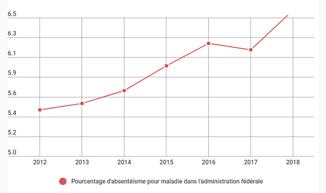

<link rel="stylesheet" href="S2.css">
<link rel="stylesheet" href="foghorn2.css">

Le 24.10.2020 a eu lieu une réunion d'information, donnée par Mathias Lenaerts, à propos de la politique de personnel du Service Facilitaire.

On y a parlé de pointage, de régime de travail et de récupération des heures supplémentaires (05, 06A et 06B), d'organisation du télétravail et de signalement des absences pour maladie.

Ce Quick Info est l'occasion de rappeler ce qui a été dit à cette occasion et qui, *mutatis mutandis*, est d'application aux collaborateurs de S2.

## Congés & récupération des heures supplémentaires

| Codes *Prime Time* | *Deadlines* |
| --- | --- | --- |
| 01A - congé annuel 2020 | 31.12.2021 |
| 01B - congé annuel 2019 | 31.12.2020 |
| 01C - congé épargné | &otimes; (= illimité, *ad lib.*) |
| 05&nbsp;&nbsp; - heures sup' (horaire flexible) | 1 &half; j. &rarr; fin du mois suivant |
| 06A - heures sup' (horaire fixe) | dans les 4 mois (mais AR 2000) |

&nbsp;

[Rapport sur l'application en 2019 des 06A]()

[Quels types de congé sont-ils possibles ?]()

Une question ? / Un doute ?  
&#10173; &#9743; ou &#9993; &rarr; Correspondant RH 

## Signalement des absences pour maladie

Absentéisme de 2010 à 2018 (Source: Medex)

| Chiffres bruts | Comparaison |
| --- | --- |
|  |  |
| <mark>scandale !!!</mark> de 5,4% à 6,6% (2012-2018) | public : 5,6%&rarr;6,6% = &Delta; +18% SDWorx : 4,5%&rarr;5,9% = &Delta; +31% Securex : 5,3%&rarr;7,1% = &Delta; +34% |

&nbsp;

&nbsp;

